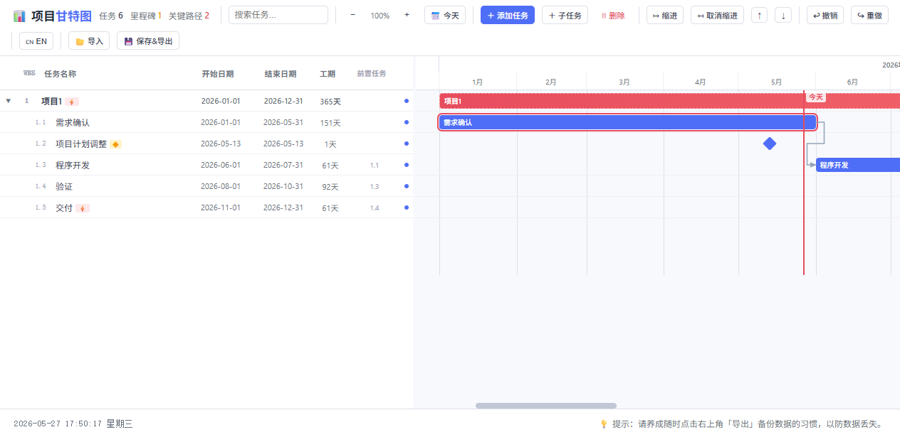

# 项目管理 · 甘特图

一个纯前端、单 HTML 文件的项目管理甘特图工具。无需安装、无需后端，浏览器打开即用。

## 功能

- **中英文切换** — 工具栏一键切换界面语言（含注释双语）
- **WBS 分解** — 按层级组织任务
- **甘特图可视化** — 直观展示任务时间线与依赖关系
- **今日线标记** — 自动高亮当天日期
- **优先级管理** — 低/中/高/紧急 四级标识
- **前置任务** — 支持任务间依赖连线
- **里程碑** — 零工期里程碑标记
- **进度追踪** — 百分比进度条显示
- **数据持久化** — 自动保存到浏览器本地存储
- **导入/导出** — JSON 格式导出与恢复

## 使用方法

1. 用浏览器打开 `index.html`
2. 点击「+ 添加任务」创建新任务
3. 拖拽甘特图上的任务条调整时间
4. 修改表格中的属性（名称、工期、优先级等）
5. 数据自动保存在浏览器中

## 许可

MIT
